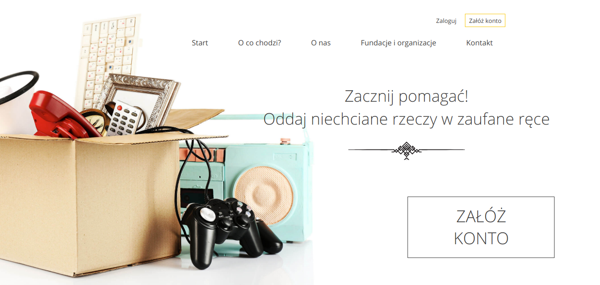
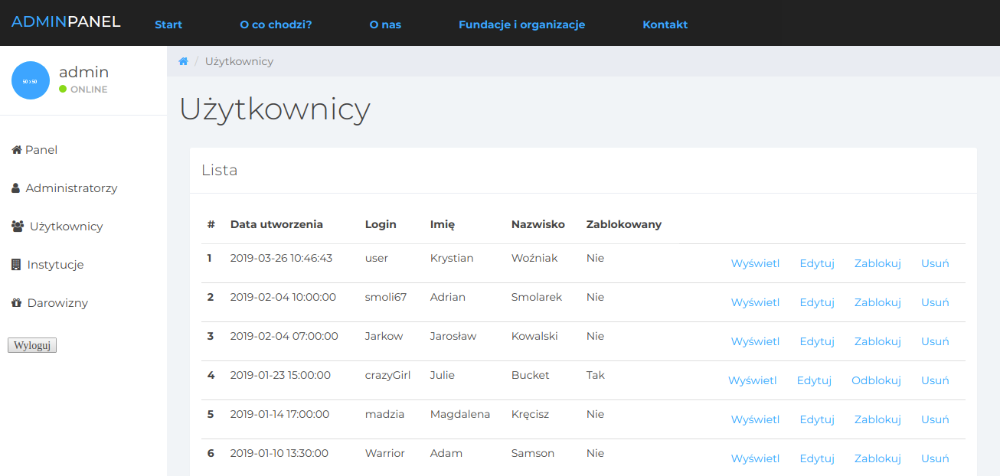
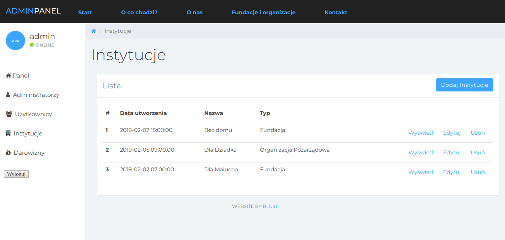
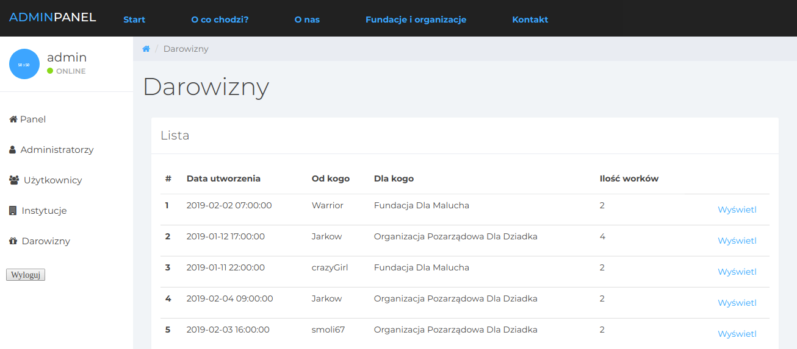
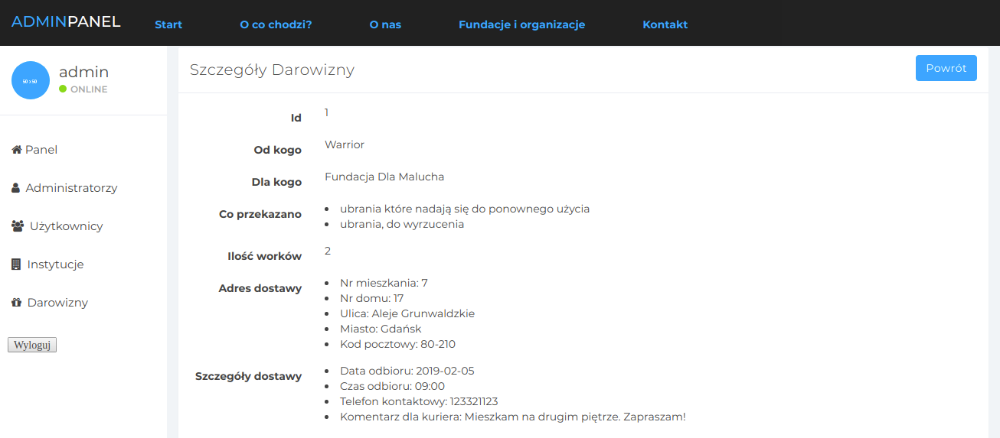
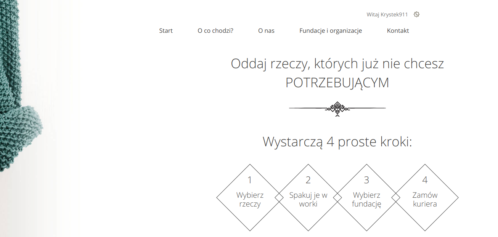
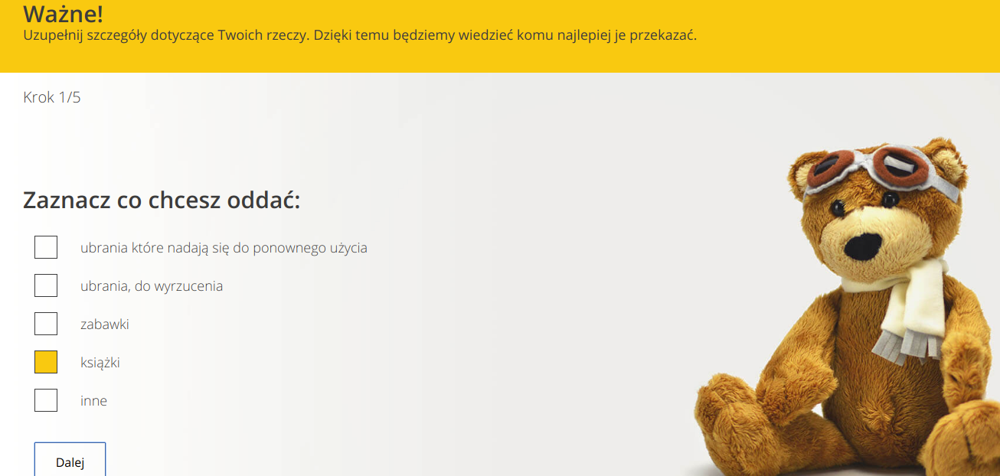
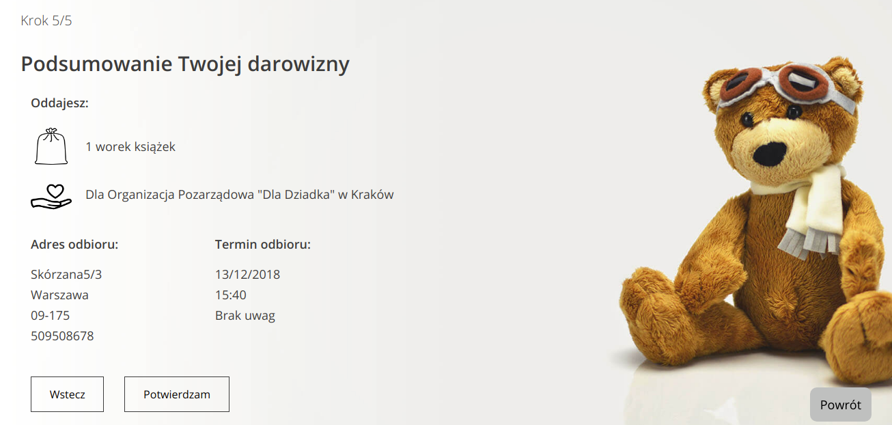

## PL "Oddam w dobre ręce" aplikacja webowa
Celem projektu jest stworzenie miejsca, w którym każdy może przekazać niepotrzebne rzeczy zaufanym instytucjom.

## EN "Oddam w dobre ręce" web app
The aim of the project is to create a place where everyone can give unnecessary things to trusted institutions.

### Technologie/Technologies:
* Spring Boot
* Spring MVC
* Spring Form
* Spring Validation
* Spring Security
* JSP
* JavaScript
* Lombok

### Few sreenshots from the app

